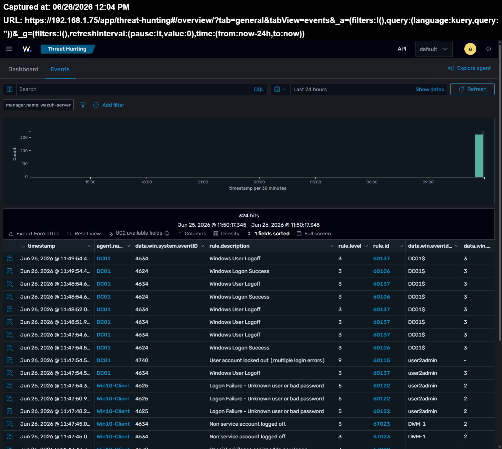
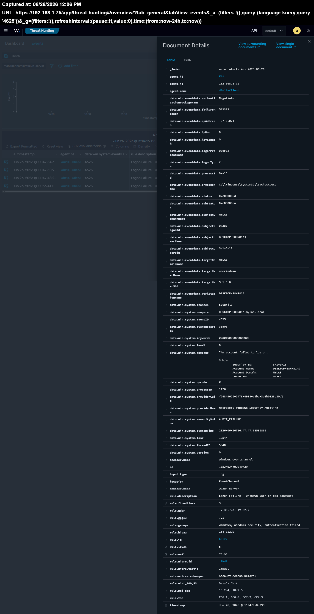
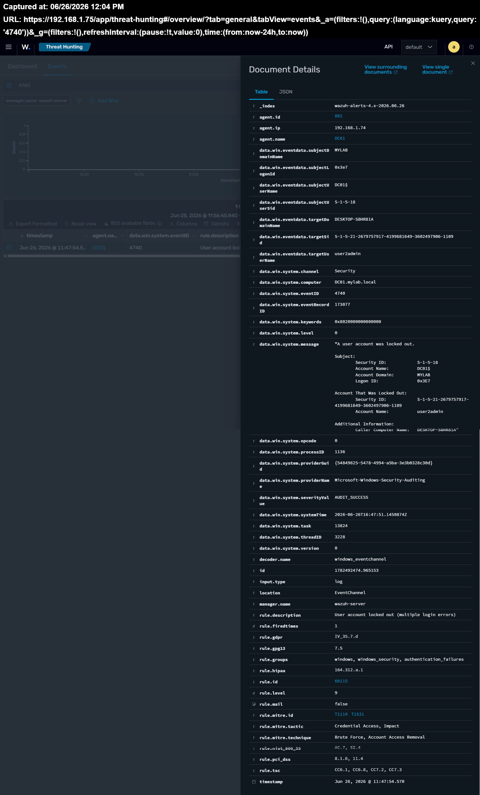
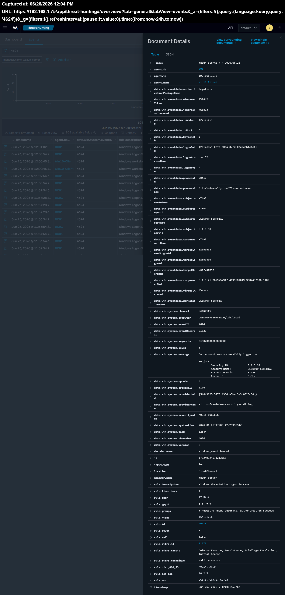

## Windows Authentication Event Correlation in Wazuh

## The Goal
I’m setting this up to get a better handle on how Windows handles authentication. The plan is to track successful logins, failed attempts, and those annoying account lockouts to see exactly what they look like inside Wazuh.

## Lab Setup
 * **Windows Server 2022** (Acting as my DC01)
 * **Windows 10** (Client machine)
 * **Wazuh 4.14** (For log collection and analysis)

## Key Events I’m Watching
I’m specifically focusing on these three Event IDs:
 * **4624:** Successful Logon
 * **4625:** Failed Logon
 * **4740:** Account Lockout

### My Investigation Process
To better understand how Windows authentication events are generated and correlated in Wazuh, I recreated a common authentication scenario in my home lab:

1. **Generated Failed Logins:** I intentionally entered the incorrect password multiple times on a Windows 10 client. As expected, **Wazuh** immediately detected and generated alerts for multiple `Event ID 4625` (Failed Logon) events.
2. **Account Lockout:** After a few more consecutive failed attempts, the account was automatically locked by the system, triggering `Event ID 4740` (User Account Locked Out).
3. **Account Recovery & Verification:** I then accessed Active Directory, unlocked the user account, and logged back in using the correct credentials. I verified that `Event ID 4624` (Successful Logon) was captured by Wazuh after the account was unlocked.

### What I Found
Watching this entire sequence play out in real-time made it much easier to understand how these authentication events interconnect. Instead of looking at isolated, disjointed log entries, I was able to follow the complete story, from the initial failed attempts and the subsequent account lockout, to the final successful login after remediation.

### Key Takeaways
This lab clearly demonstrated why authentication logs are among the first places a SOC analyst should look during an investigation. 

* A single log event rarely tells the whole story. 
* Correlating multiple events together (`4625 → 4740 → 4624`) provides the necessary context to understand exactly what happened, allowing analysts to distinguish between normal user behavior and potential malicious activity.

## My Investigation Process
*Work in progress—I’ll be adding these in a future update.*

## What I Found
*Work in progress—I’ll be adding these in a future update.*

## Takeaways
*Work in progress—I’ll be adding these in a future update.*

## Skills Demonstrated
- Windows Authentication
- Active Directory
- Wazuh SIEM
- Log Analysis
- Event Correlation
- Authentication Monitoring

## Screenshots

### Authentication Events Overview

### Failed Logon (Event ID 4625)

### Account Lockout (Event ID 4740)

### Successful Logon (Event ID 4624)

