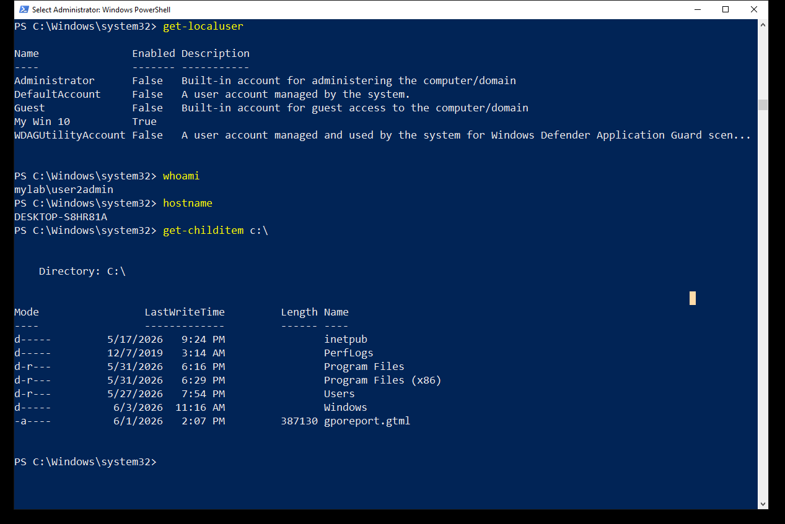
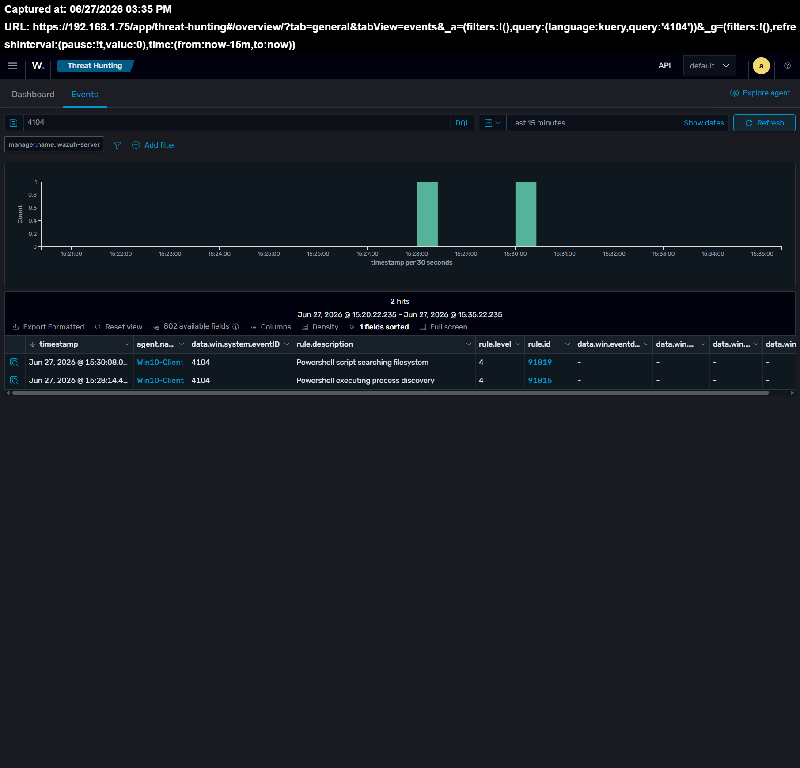
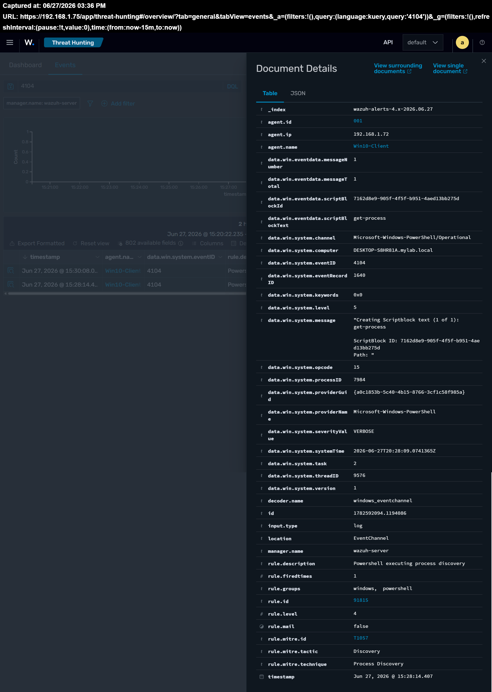
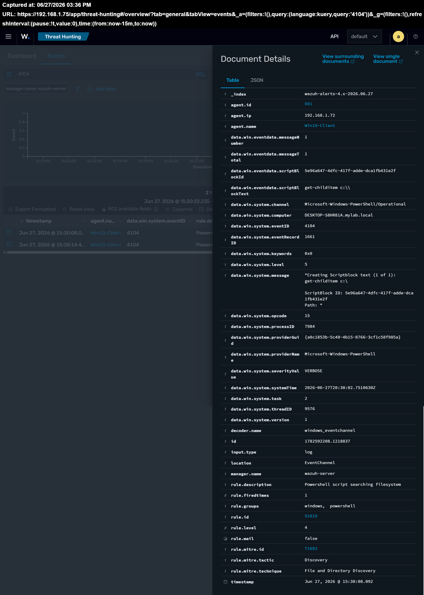

# User Activity & PowerShell Monitoring with Wazuh

## Overview

This project documents my hands-on lab focused on monitoring Windows user activity and PowerShell execution using Wazuh. The goal is to understand how security analysts can detect suspicious behavior, investigate user actions, and analyze security events in a Windows environment.

## Objectives

- Monitor Windows user activity
- Monitor PowerShell execution
- Analyze Windows Event Logs
- Investigate security events using Wazuh

## Lab Environment

| Component | Details |
|----------|---------|
| SIEM | Wazuh 4.14 |
| Domain Controller | Windows Server 2022 |
| Client | Windows 10 |
| Linux Server | Ubuntu Server |
| Virtualization | Hyper-V |
| Monitoring | Windows Event Logs, Sysmon |

## Investigation Steps

1. Opened Windows PowerShell as Administrator on the Windows 10 client.
2. Executed the following PowerShell commands:
   - Get-LocalUser
   - whoami
   - hostname
   - Get-ChildItem C:\
3. Verified that PowerShell Script Block Logging (Event ID 4104) was generated.
4. Opened the Wazuh Threat Hunting dashboard.
5. Filtered events using Event ID 4104.
6. Reviewed Wazuh detection rules and correlated the PowerShell activity with MITRE ATT&CK techniques.

---

## Detection Results

The executed PowerShell commands were successfully captured by Windows PowerShell Operational Logs (Event ID 4104) and forwarded to Wazuh.

Wazuh generated the following detections:

| Rule ID | Description | Event ID | MITRE |
|---------|-------------|---------|--------|
| 91815 | PowerShell executing process discovery | 4104 | T1057 |
| 91819 | PowerShell script searching filesystem | 4104 | T1083 |

---

## MITRE ATT&CK Mapping

| Technique ID | Technique |
|--------------|-----------|
| T1057 | Process Discovery |
| T1083 | File and Directory Discovery |

These techniques represent common discovery activities performed by attackers after gaining initial access to a system.

---

## Screenshots

### Executed PowerShell Commands

### Event ID 4104 Overview

### Rule 91815 – Process Discovery

### Rule 91819 – File and Directory Discovery

## Conclusion

This lab demonstrates how native PowerShell activity can be monitored using Windows PowerShell Operational Logs and Wazuh SIEM. By enabling Script Block Logging (Event ID 4104), PowerShell commands were successfully captured, correlated with Wazuh detection rules, and mapped to MITRE ATT&CK techniques.

Although the executed commands were legitimate administrative actions, the same techniques are frequently used by attackers during the discovery phase of an intrusion. This highlights the importance of monitoring PowerShell activity as part of a SOC analyst's investigation workflow.
