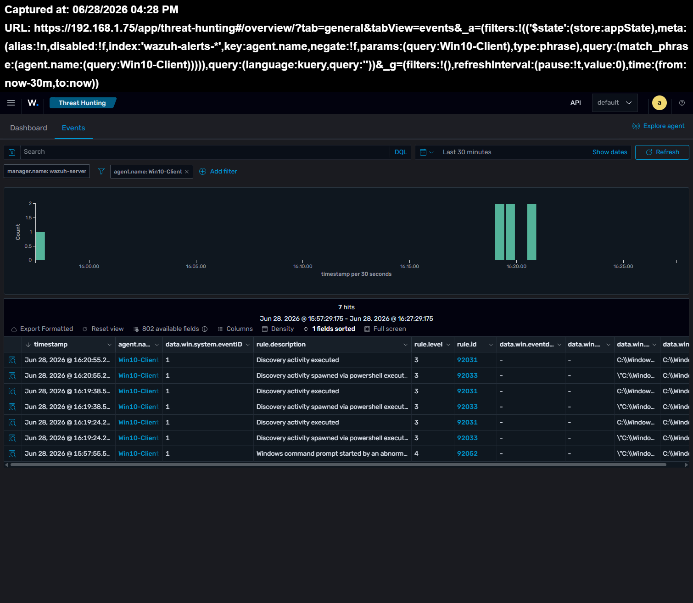
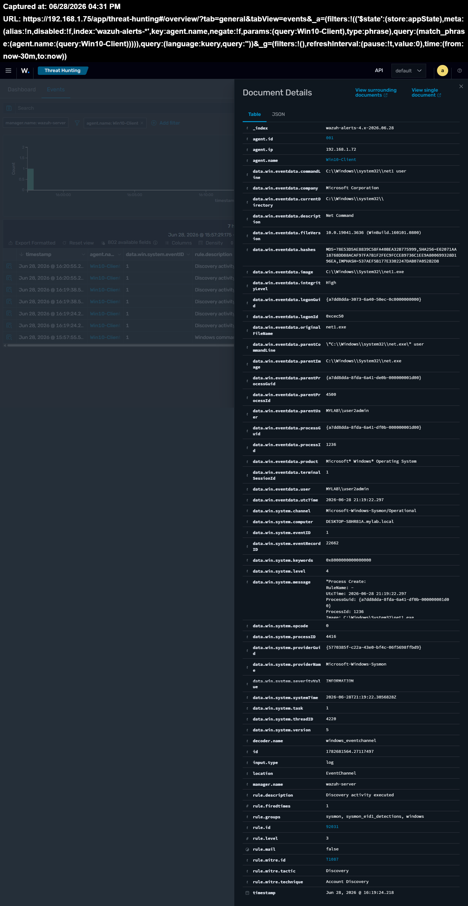
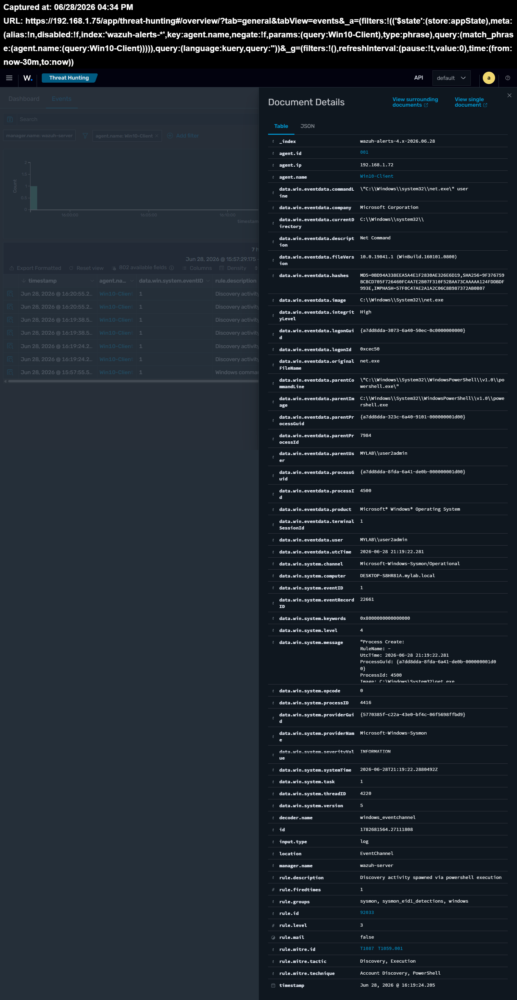
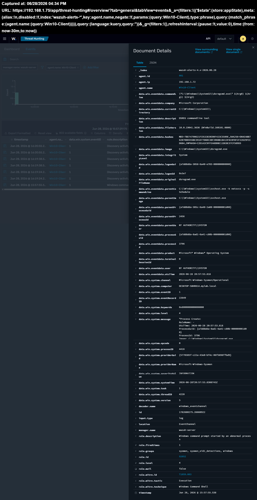

# Part 14C — Windows Discovery Activity Monitoring

## Overview

This project documents a hands-on lab where I generated common Windows discovery activity and monitored the resulting events using Sysmon and Wazuh.

The objective was to understand how basic system and network discovery commands appear in endpoint telemetry and how they can be analyzed during a security investigation.

| Category | Value |
|----------|-------|
| Platform | Windows 10 |
| SIEM | Wazuh 4.14 |
| Data Source | Sysmon (Event ID 1) |
| Focus | Windows Discovery Activity |
| MITRE ATT&CK | T1087, T1069.001, T1069.002, T1016, T1018, T1049, T1057 |
| Lab Type | Active Directory Home Lab |

## Objectives

- Generate common Windows discovery activity using built-in command-line tools.
- Monitor endpoint events collected by Sysmon.
- Analyze related telemetry in the Wazuh dashboard.
- Understand how normal administrative commands can also appear during attacker reconnaissance.
- Practice documenting findings in a structured SOC investigation format.

## Investigation Steps

### Step 1 — Generate Windows Discovery Activity

On the Windows 10 endpoint, I executed several built-in Windows commands to generate discovery-related activity.

The following commands were executed:

```cmd
whoami
hostname
ipconfig
ping 8.8.8.8 -n 4
nslookup google.com
net user
net localgroup
net localgroup administrators
netstat -ano
tasklist
tasklist /svc
```

These commands generated Sysmon Process Create (Event ID 1) events that were forwarded to Wazuh for analysis.

## Detection Results

After executing the Windows discovery commands, Wazuh successfully detected and categorized the generated activity based on Sysmon Process Create (Event ID 1).

The investigation identified the following detection rules:

- **Rule 92031** – Discovery activity executed
- **Rule 92033** – Discovery activity detected through Wazuh correlation (Rule 92033)
- **Rule 92052** – Windows command prompt started by an abnormal process

These detections demonstrate how common Windows administrative commands can be monitored and analyzed during endpoint investigations.

### Threat Hunting Overview



### Rule 92031 – Discovery Activity Executed



### Rule 92033 – Discovery Activity via PowerShell



### Rule 92052 – Command Prompt Started by an Abnormal Process



## MITRE ATT&CK Mapping

| Technique ID | Technique | Description |
|--------------|-----------|-------------|
| T1087 | Account Discovery | Commands such as `net user` were used to enumerate local user accounts. |
| T1069.001 | Local Groups Discovery | `net localgroup` was used to enumerate local security groups. |
| T1069.002 | Domain Groups Discovery | `net localgroup administrators` revealed domain administrator group membership. |
| T1016 | System Network Configuration Discovery | `ipconfig` was used to gather network configuration information. |
| T1018 | Remote System Discovery | `ping` was used to verify network connectivity. |
| T1016 | System Network Configuration Discovery | `nslookup` was used to query DNS information. |
| T1049 | System Network Connections Discovery | `netstat` was used to view active network connections. |
| T1057 | Process Discovery | `tasklist` was used to enumerate running processes. |

## Key Takeaways

- Windows administrative commands can generate valuable security telemetry even when used for legitimate purposes.
- Sysmon Event ID 1 provides detailed process creation information that is useful for endpoint investigations.
- Wazuh detection rules can automatically identify common discovery activities and map them to the MITRE ATT&CK framework.
- Multiple low-risk discovery commands executed together may indicate reconnaissance behavior and should be investigated in context.

## Conclusion

This lab demonstrated how common Windows discovery commands generate valuable endpoint telemetry that can be monitored using Sysmon and analyzed in Wazuh.

Although the executed commands were legitimate administrative tools, Wazuh successfully detected and categorized the activity using multiple detection rules aligned with the MITRE ATT&CK framework.

This exercise improved my understanding of endpoint visibility, process monitoring, and how seemingly normal commands can also be indicators of reconnaissance activity during a security investigation.

